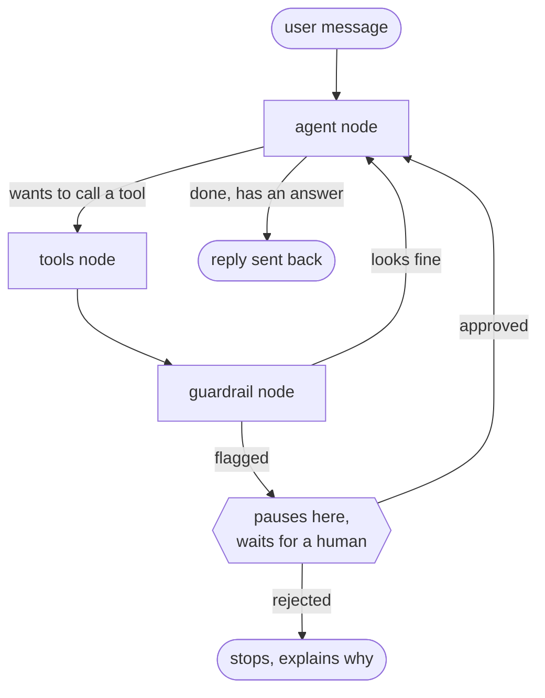
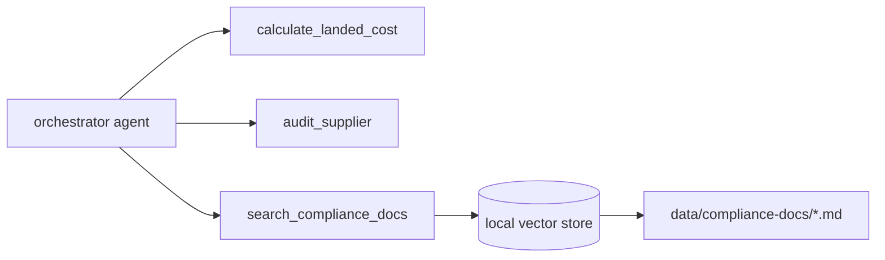

# GlobalGate Agent

A multi-agent assistant for import/export operations. It checks supplier risk, calculates
Incoterms and landed shipping costs, and looks up compliance info from a small local knowledge
base. Built with LangGraph.js to get hands-on with agent orchestration, tool calling, RAG, and
human-in-the-loop approval flows.

## Why I built this

I studied international trade and import/export about eight years ago, well before I got into
software, so this project comes out of an older interest rather than something I just decided
to try. I've spent time learning what actually trips companies up when they source from
overseas: telling whether a supplier is trustworthy before you've sent any money, knowing who's
responsible for what once a shipment leaves the factory, and keeping up with customs rules that
change depending on exactly what you're shipping. When I wanted to build something real with
agents instead of just following a tutorial, this was the obvious choice, because I already
understood the problem from the business side, not just the code side.

The part I cared about most is the guardrail. If an agent flags a supplier as high risk or
comes back with a shipping cost that's way higher than expected, I don't think it should just
keep going and hand you an answer like everything's fine. So there's a step that pauses the
whole process and waits for a human to say yes or no before it continues. That felt like the
actual point of building this, not the flashy part.

## What it does

- **`audit_supplier`** checks a Chinese supplier by name and returns a Green/Yellow/Red risk
  rating (currently mocked with deterministic fake data, but built so a real API call could
  slot in without changing anything else)
- **`calculate_landed_cost`** walks through a 3-question logistics questionnaire, figures out
  the right Incoterm (EXW/FOB/CIF), and calculates the full landed cost with all the line items
- **`search_compliance_docs`** is a small RAG setup over a handful of markdown docs (NNN
  agreements, restricted goods shipping rules, HS code basics) so the agent can actually cite
  something instead of making up regulatory info
- A human-in-the-loop guardrail. If a tool call comes back with a red-flag supplier, a cost
  above a threshold, or a compliance alert, the graph pauses and waits for approval before doing
  anything else

## How it's wired together



I built the graph by hand with LangGraph's `StateGraph` instead of using the prebuilt agent
helper, mostly so I could actually see and control where the guardrail check happens, rather
than it being buried inside a library.



## Project layout

```
src/
  agents/orchestratorAgent.js    the model, bound to all 3 tools
  tools/
    costCalculatorTool.js
    supplierAuditTool.js
    complianceRagTool.js
  rag/knowledgeBase.js           builds the vector store from the docs
  guardrails/
    anomalyRules.js              the actual "is this risky" checks
    humanApprovalNode.js         the graph node that pauses on a flag
  workflows/
    state.js
    graph.js                     wires everything together
  config/index.js
  index.js                       Express server, /chat and /chat/resume
data/compliance-docs/            the markdown files the RAG tool searches
```

## Stack and a couple of choices I made on purpose

- **LangGraph.js** for the orchestration. I wanted the explicit state machine, not a black box
- **Claude** via `@langchain/anthropic` for the actual model
- **Local embeddings** (`@xenova/transformers`, runs in-process, no API key) instead of a
  hosted embeddings API. I didn't want to need a second paid service just to embed three
  markdown files
- **In-memory vector store** instead of something like Chroma. For a handful of short docs,
  standing up a whole vector DB felt like overkill. If the doc set ever got big this is the
  part I'd swap out first, and the retrieval function is written so that swap wouldn't touch
  anything else that calls it
- The threshold for "this cost is too high, ask a human" lives in `.env`
  (`HIGH_COST_THRESHOLD_USD`), not hardcoded, so it's adjustable without touching code

## Running it

```bash
git clone https://github.com/<your-username>/globalgate-agent.git
cd globalgate-agent
npm install
cp .env.example .env
```

Put your real Anthropic key in `.env`:

```
ANTHROPIC_API_KEY=sk-ant-your-real-key-here
```

Then:

```bash
npm run dev
```

Runs on `http://localhost:4002` by default.

Try it:

```bash
curl -X POST http://localhost:4002/chat \
  -H "Content-Type: application/json" \
  -d '{"message": "Can you check this supplier for me, Shenzhen Example Co?"}'
```

If that supplier happens to land on a RED risk rating (it's deterministic based on the name, so
some names trigger it), you won't get a normal reply. You'll get something like this instead:

```json
{
  "status": "PENDING_APPROVAL",
  "threadId": "...",
  "anomaly": { "type": "HIGH_RISK_SUPPLIER", "message": "..." },
  "toolName": "audit_supplier",
  "toolResult": { "...": "..." }
}
```

To approve or reject it (same `threadId`):

```bash
curl -X POST http://localhost:4002/chat/resume \
  -H "Content-Type: application/json" \
  -d '{"threadId": "...", "approved": true}'
```

## Honest limitations, what I still need to test

I haven't actually run the interrupt/resume flow end to end against a live install yet. It's
built against LangGraph's documented interrupt API, but if you upgrade `@langchain/langgraph`
and `PENDING_APPROVAL` doesn't show up when it should, check `formatGraphResult()` in
`index.js`. There's a note there about the field name.

Supplier data is mocked, not a real registry lookup. Wiring in a real API is the obvious next
step.

Checkpoints are kept in memory (`MemorySaver`), so if the server restarts mid conversation, a
paused approval is just gone. Fine for a demo, not fine for anything real. Would need a
persistent checkpointer before this went anywhere near production.

## What I'd add next

- A real supplier-registry API behind the existing mock
- A persistent checkpointer so paused approvals survive a restart
- Streaming responses instead of waiting for the whole reply
- Some kind of actual UI for the approval step instead of curling `/chat/resume` by hand
